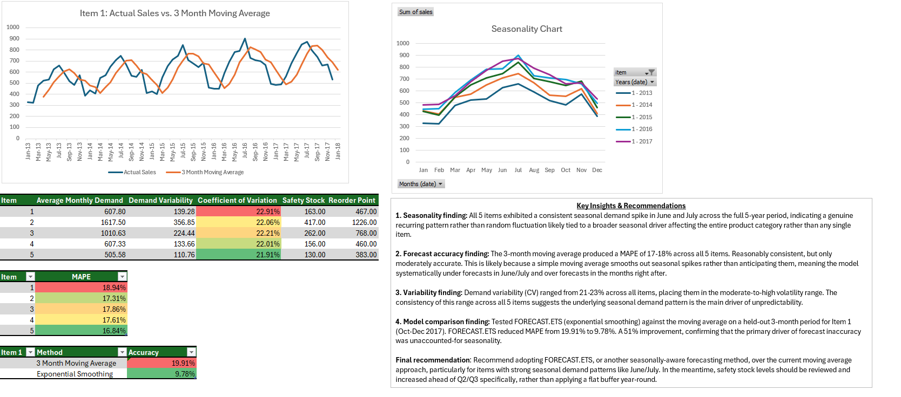

# demand-forecasting-inventory-analysis
Project Summary: Analyzed 5 years of historical sales data to forecast demand and calculate inventory safety stock and reorder points for 5 products. Built a 3-month moving average forecast as a baseline, then tested a seasonality-aware forecasting method (Excel's FORECAST.ETS) after identifying a recurring seasonal demand pattern and validated which approach was actually more accurate using a holdout test.

Dataset
Store Item Demand Forecasting Challenge (Kaggle) - 5 years of daily sales data across 10 stores and 50 items. Filtered down to 1 store and 5 items over 5 years for a focused, in-depth analysis.

Tools & Methods
Excel: PivotTables, 3-month moving average, FORECAST.ETS (exponential smoothing), safety stock & reorder point calculations, conditional formatting, dashboard design
Techniques: seasonality analysis, coefficient of variation (CV), MAPE (Mean Absolute Percentage Error), holdout testing

Key Findings
1. Seasonality finding: All 5 items exhibited a consistent seasonal demand spike in June and July across the full 5-year period, indicating a genuine recurring pattern rather than random fluctuation likely tied to a broader seasonal driver affecting the entire product category rather than any single item.
2. Forecast accuracy finding: The 3-month moving average produced a MAPE of 17-18% across all 5 items. Reasonably consistent, but only moderately accurate. This is likely because a simple moving average smooths out seasonal spikes rather than anticipating them, meaning the model systematically under forecasts in June/July and over forecasts in the months right after.
3. Variability finding: Demand variability (CV) ranged from 21-23% across all items, placing them in the moderate-to-high volatility range. The consistency of this range across all 5 items suggests the underlying seasonal demand pattern is the main driver of unpredictability.
4. Model comparison finding: Tested FORECAST.ETS (exponential smoothing) against the moving average on a held-out 3-month period for Item 1 (Oct-Dec 2017). FORECAST.ETS reduced MAPE from 19.91% to 9.78%. A 51% improvement, confirming that the primary driver of forecast inaccuracy was unaccounted-for seasonality.

Final recommendation: Recommend adopting FORECAST.ETS, or another seasonally-aware forecasting method, over the current moving average approach, particularly for items with strong seasonal demand patterns like June/July. In the meantime, safety stock levels should be reviewed and increased ahead of Q2/Q3 specifically, rather than applying a flat buffer year-round.

Dashboard 

The dashboard above includes: actual vs. forecasted sales by item, a year-over-year seasonality chart, a summary table of demand/CV/safety stock/reorder point across all 5 items, and a moving average vs. FORECAST.ETS accuracy comparison.

Files

[Full Excel File](DemandForecastAnalysisProjectFINAL.xlsx) - full working file with raw data, item-level forecasts, safety stock/reorder point calculations, and the dashboard

